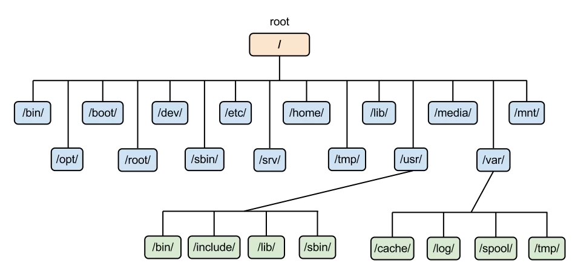

# 1. Working in the terminal  
#### 1.1: Introduction to DevOps  
  
#### 1.2: Linux Basics  
  
/bin - Contains essential binary executables (commands) that are required for system boot and repair.  
/boot - Contains boot loader files and the Linux kernel.  
/dev - Contains device files, representing physical and virtual devices.  
/etc - Contains system-wide configuration files and startup scripts.  
/home - Home directories for regular users.  
/lib - Contains shared library files used by system programs.  
/media - Mount point for removable media such as USB drives.  
/mnt - Temporarily mounted filesystems.  
/opt - Optional software packages.  
/proc - Virtual filesystem providing information about processes and system resources.  
/root - Home directory for the root user.  
/run - Runtime data for system services.  
/sbin - Contains essential system binaries, typically used by the root user.  
/srv - Data for services provided by the system.  
/sys - Virtual filesystem providing information about the system's hardware devices, drivers, and kernel features.  
/tmp - Temporary files.  
/usr - Contains user applications and utilities.  
/var - Variable data files such as logs, databases, and spool files.  
 - user / rights management
```bash 
# Создать нового пользователя с домашним каталогом
sudo useradd -m newuser

# Установить пароль для нового пользователя
sudo passwd newuser

# Добавить нового пользователя в группу sudo
sudo usermod -aG sudo newuser
```
 useradd  
 passwd  
 userdel  
 usermod  
 chmod  
 chown  

#### 1.3: SSH and Firewall
-- How to copy SSH keys to multiple servers  
nano server.list
 ```bash 
192.168.0.100 #1st ip
192.168.0.101 #2nd ip
...
```
nano script.sh
```bash  
#!/bin/bash
while read -r line
do
    echo "running $line"
    sshpass -p <PWD> ssh-copy-id <NAMEя>@$line -o "StrictHostKeyChecking no" 
    # apt-get install sshpass NEEDS TO BE INSTALLED
done < "server.list"
```  

ssh-keygen   
ssh-copy-id   
ssh root@89.111.111.11 (ssh -p port user@host)   
scp user12@8server:/home/timeweb/Desktop Documents/   

#### 1.4: Monitoring and Server Performance  
UFW/firewalld/..  

ufw disable ('enable', 'reload', 'reset', 'status')  
ufw allow 53  
ufw deny 80/tcp  
ufw allow in http  
ufw reject out smtp  
ufw reject telnet comment 'telnet is unencrypted'  
ufw logging LEVEL ('off', 'low', 'medium', 'high' and 'full')  

lsb_release -a / cat /etc/os-release  
uname \ hostname  
lscpu \ free -h \ df-h \ lsblk \ top  
sudo journalctl _PID=1  
dstat --top-cpu --top-io --top-latency --top-mem  
sudo journalctl -u fail2ban.service  
ip a \ ip link show \ ip (-6) route show \ traceroute (or mtr) \ resolvectl status \ sudo ss  
