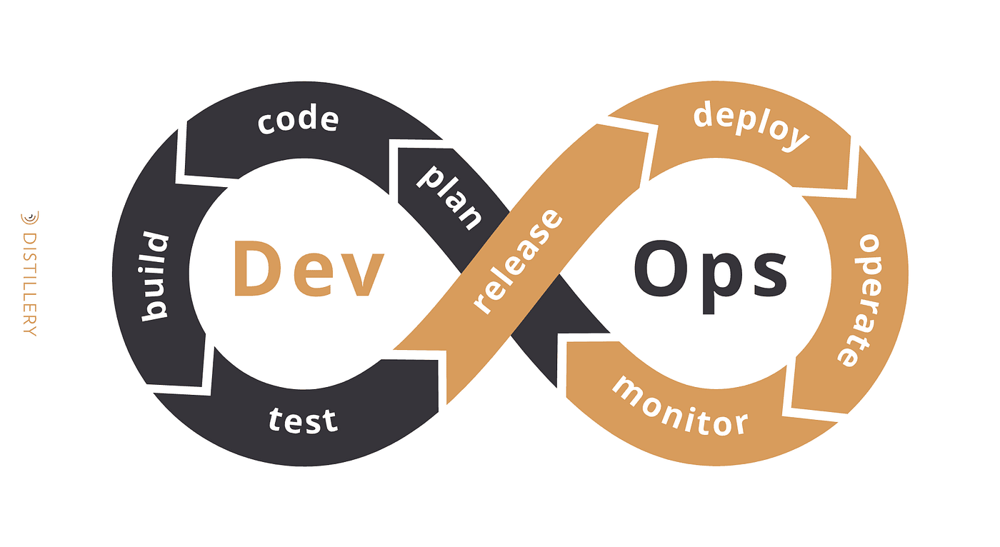
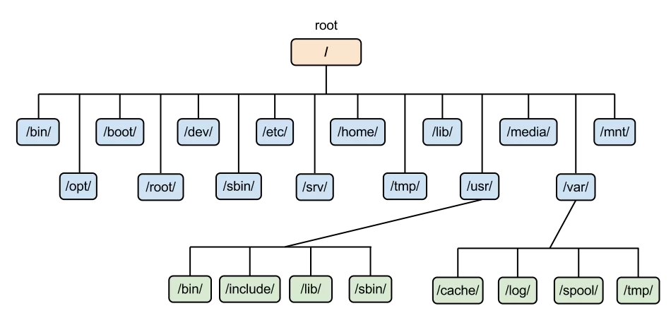

# 1. Working in the terminal  
#### 1.1: Introduction to DevOps  
  
#### 1.2: Linux Basics  
  
/bin - Contains essential binary executables (commands) that are required for system boot and repair.  
/boot - Contains boot loader files and the Linux kernel.  
/dev - Contains device files, representing physical and virtual devices.  
/etc - Contains system-wide configuration files and startup scripts.  
/home - Home directories for regular users.  
/lib - Contains shared library files used by system programs.  
/media - Mount point for removable media such as USB drives.  
/mnt - Temporarily mounted filesystems.  
/opt - Optional software packages.  
/proc - Virtual filesystem providing information about processes and system resources.  
/root - Home directory for the root user.  
/run - Runtime data for system services.  
/sbin - Contains essential system binaries, typically used by the root user.  
/srv - Data for services provided by the system.  
/sys - Virtual filesystem providing information about the system's hardware devices, drivers, and kernel features.  
/tmp - Temporary files.  
/usr - Contains user applications and utilities.  
/var - Variable data files such as logs, databases, and spool files.  
 - user / rights management
```bash 
# Создать нового пользователя с домашним каталогом
sudo useradd -m newuser

# Установить пароль для нового пользователя
sudo passwd newuser

# Добавить нового пользователя в группу sudo
sudo usermod -aG sudo newuser
```
 useradd  
 passwd  
 userdel  
 usermod  
 chmod  
 chown  

#### 1.3: SSH and Firewall
-- How to copy SSH keys to multiple servers  
nano server.list
 ```bash 
192.168.0.100 #1st ip
192.168.0.101 #2nd ip
...
```
nano script.sh
```bash  
#!/bin/bash
while read -r line
do
    echo "running $line"
    sshpass -p <PWD> ssh-copy-id <NAMEя>@$line -o "StrictHostKeyChecking no" 
    # apt-get install sshpass NEEDS TO BE INSTALLED
done < "server.list"
```  

ssh-keygen   
ssh-copy-id   
ssh root@89.111.111.11 (ssh -p port user@host)   
scp user12@8server:/home/timeweb/Desktop Documents/   

#### 1.4: Monitoring and Server Performance  
UFW/firewalld/..  

ufw disable ('enable', 'reload', 'reset', 'status')  
ufw allow 53  
ufw deny 80/tcp  
ufw allow in http  
ufw reject out smtp  
ufw reject telnet comment 'telnet is unencrypted'  
ufw logging LEVEL ('off', 'low', 'medium', 'high' and 'full')  

lsb_release -a / cat /etc/os-release  
uname \ hostname  
lscpu \ free -h \ df-h \ lsblk \ top  
sudo journalctl _PID=1  
dstat --top-cpu --top-io --top-latency --top-mem  
sudo journalctl -u fail2ban.service  
ip a \ ip link show \ ip (-6) route show \ traceroute (or mtr) \ resolvectl status \ sudo ss  


# 2.1: Bash. Writing scripts in Linux

What is BASH?  
Bash (Bourne Again SHell) is a Unix shell and command language written by Brian Fox for the GNU Project as a free software replacement for the Bourne shell (sh). It is widely used as the default shell on Linux and macOS systems. Bash combines features of both the Bourne shell and the C shell, providing a powerful and flexible environment for command execution, scripting, and automation.  
## Here are some key features and characteristics of Bash:  
1. **Command Execution**:  
   Bash allows users to execute commands by typing them into the terminal. These commands can be simple utilities, complex pipelines, or scripts.
3. **Scripting**:  
   Bash supports scripting, enabling users to write scripts to automate repetitive tasks, manage system configurations, and perform complex operations.
2. **Variables**:  
   Bash supports the use of variables to store data, which can be used and manipulated within scripts and commands.
2. **Control Structures**:  
   Bash provides control structures such as loops (for, while), conditionals (if, case), and functions, which allow for more complex and conditional execution of commands.
2. **Job Control**:
   Bash supports job control, allowing users to manage background and foreground processes, suspend and resume jobs, and handle process signals.
2. **Command History**:  
   Bash maintains a history of executed commands, enabling users to recall, edit, and re-execute previous commands.
2. **Aliases and Functions**:  
   Users can create aliases and functions to simplify complex commands or create custom commands.
2. **Redirection and Pipelines**:
   Bash allows input and output redirection (using >, <, >>, <<) and pipelines (using |) to connect commands and manipulate data streams.
2. **Environment Customization**:
   Bash allows extensive customization of the environment through configuration files like .bashrc, .bash_profile, and .bash_logout.
2. **Tab Completion**:
   Bash provides tab completion to help users quickly complete file names, commands, and variables, enhancing productivity.

## Example of a Simple Bash Script:
 ```bash
#!/bin/bash
# This is a simple Bash script
echo "Hello, World!"
# Define a variable
name="Alice"
# Use the variable
echo "Hello, $name!"
# A simple for loop
for i in {1..5}
do
   echo "Loop iteration $i"
done
# A simple function
greet() {
    echo "Hello, $1!"
}
# Call the function
greet "Bob"
```
## Common Use Cases for Bash:
1. **System Administration**: Automating system maintenance tasks, managing files, and configuring servers.
2. **Development**: Compiling code, running tests, and deploying applications.
3. **Data Processing**: Manipulating and analyzing text files and data streams.
4. **Networking**: Managing network configurations and automating network tasks.
5. **Scripting Utilities**: Creating custom command-line tools and utilities.

## Here are examples of loops in Bash:
1. for Loop  
 ```bash
#!/bin/bash
# Simple for loop example
for i in {1..5}
do
    echo "Iteration $i"
done
 ```
2. while Loop  
 ```bash
#!/bin/bash
# Simple while loop example
counter=0
while [ $counter -lt 5 ]
do
    echo "Counter is $counter"
    ((counter++))
done
 ```
3. until Loop  
 ```bash
#!/bin/bash

# Simple until loop example
counter=0
until [ $counter -ge 5 ]
do
    echo "Counter is $counter"
    ((counter++))
done
 ```

